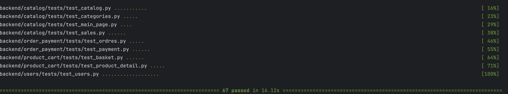
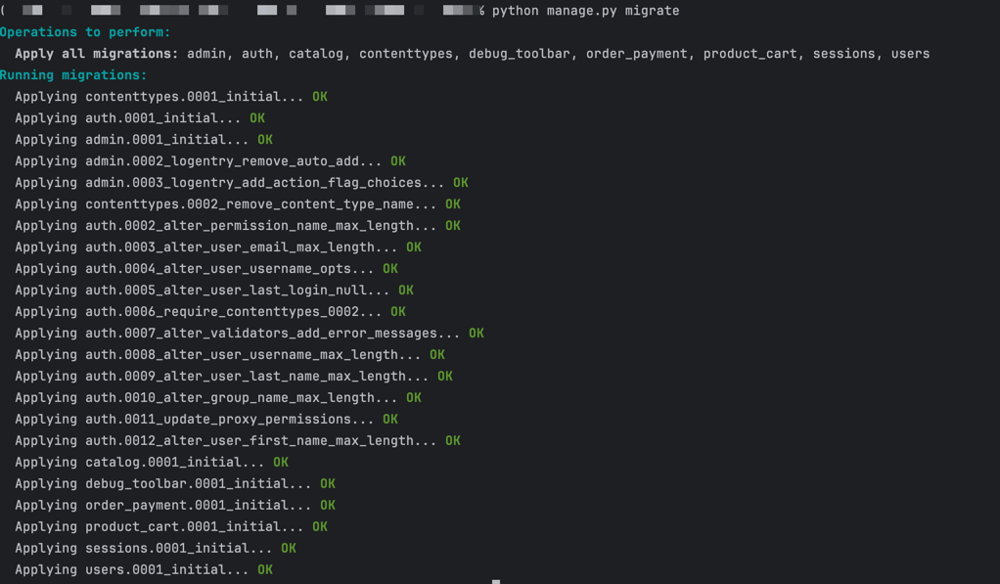
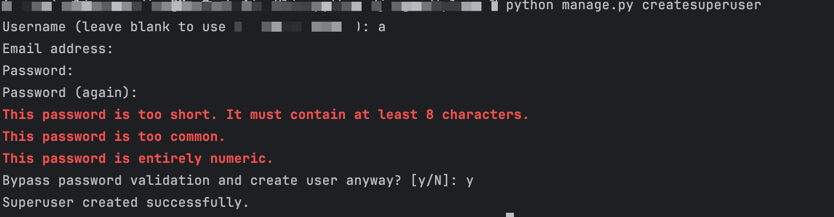

# Описание проекта "Megano shop"

Учебный проект представляет собой бэкенд-составляющую для интернет-магазина, включающую API-функции и взаимодействие с базой данных. Он позволяет через 
встроенную административную панель Django:
- Создавать и редактировать:
  - Профили пользователей;
  - Категории товаров;
  - Товары, фото товаров;
  - Теги;
  - Спецификации товаров;
  - Заказы и оплаты;

## Технологии и библиотеки
- **Python 3.12**: основной язык программирования проекта;
- **Django 5.2.3**: основной фреймворк для backend разработки;
- **DRF 3.16.0**: Django REST Framework для создания API;
- **Pytest**: Используется для написания и выполнения тестов;

## Структура проекта
- **backend**: Содержит всю логику работы бэкенда;
  - **backend/catalog**: Django приложение, реализующее логику работы каталога товаров;
  - **backend/config**: Django конфигурация;
  - **backend/frontend**: Шаблоны и статические файлы для работы приложения;
  - **backend/order_payment**: Django приложение, реализующее логику работы с заказами и тестовыми оплатами без интеграции с платежными системами.
  - **backend/product_cart**: Django приложение, реализующее логику детального отображения карточки товара.
  - **backend/users**: Django приложение, реализующее логику регистрации и авторизации пользователей.

## Установка и настройка
1. Клонирование репозитория:
    ```bash
    git clone <URL репозитория>
    cd <Имя папки проекта>
    ```
2. Устанавливаем poetry:
    ```bash
    pip install poetry
   ```
   
3. Установка зависимостей:
    ```bash
   poetry install
   ```
   
4. Запуск тестов:
    ```bash
   pytest -v 
   ```
   
    После успешного прохождения тестов
    
    Нужно запустить первичные миграции, чтобы создать user-админа:

5. Миграции:
    ```bash
   python manage.py migrate
   ```
   

6. Создание суперпользователя:
    ```bash
   python manage.py createsuperuser
   ```
   - вводим username;
   - вводим email (необязательно, можно будет добавить позже);
   - вводим пароль;
    

7. Запускаем cервер (development):
    ```bash
   python manage.py runserver
   ```
   
- Административная панель: `http://localhost:8000/admin`
- Главная страница: `http://localhost:8000`
- Swagger: `http://localhost:8000/api/schema/swagger`

